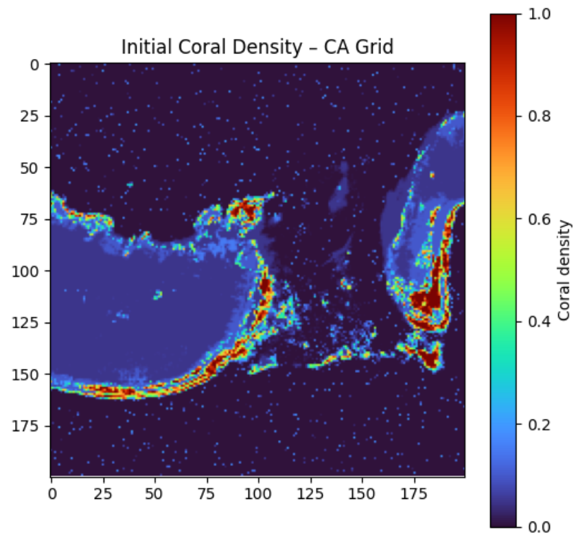
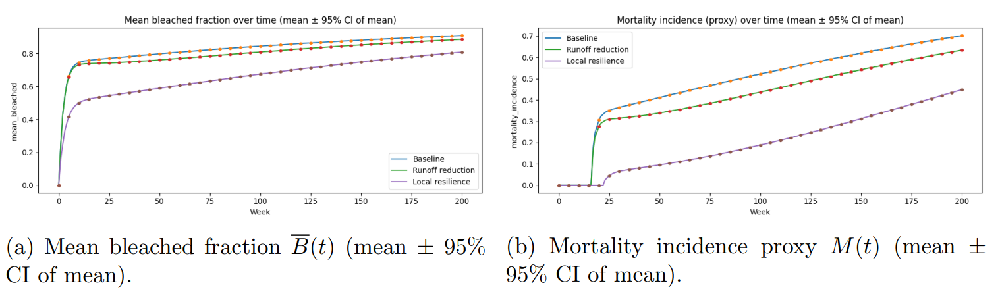

# Coral Reef Bleaching Simulation: A Spatial Cellular Automata Model

A spatial environmental simulation modeling coral bleaching dynamics under climate stress, acidification, and pollution using a stochastic cellular automata framework.

---

## Project Structure

---

## Overview

This project implements a spatial cellular automata simulation to model coral reef ecosystem dynamics under environmental stressors including temperature anomalies, ocean acidification, and agricultural runoff pollution. The model evaluates environmental management strategies through stochastic Monte Carlo experiments.

---

## System Model and Dynamics

The reef is modeled as a 2D grid tracking coral density, bleaching state, pollution levels, and stress exposure. Environmental stress combines global heat events, gradual acidification, and spatially transported pollution inflow.

---

## Key Concepts & Features

- Spatial Cellular Automata Simulation
- Environmental Stress Modeling
- Pollution Transport Dynamics
- Monte Carlo Scenario Experiments
- Ecosystem Resilience Analysis
- Mean-Field Theoretical Modeling

---

## Results: Coral Abundance Under Different Scenarios

Baseline and runoff-reduction scenarios lead to long-term coral decline, while local resilience interventions delay mortality and preserve higher coral density.

---

## Bleaching and Mortality Dynamics

Bleaching spreads rapidly under sustained stress conditions, increasing mortality incidence over time. Local resilience interventions reduce bleaching severity and delay collapse.

---

## Spatial Outcome Distributions

Spatial analysis highlights uneven reef survival patterns and demonstrates how localized resilience strategies preserve high-density coral patches.

---

## Tech Stack

- Python
- NumPy
- SciPy
- Matplotlib
- Cellular Automata Modeling
- Monte Carlo Simulation
- Environmental Systems Modeling

